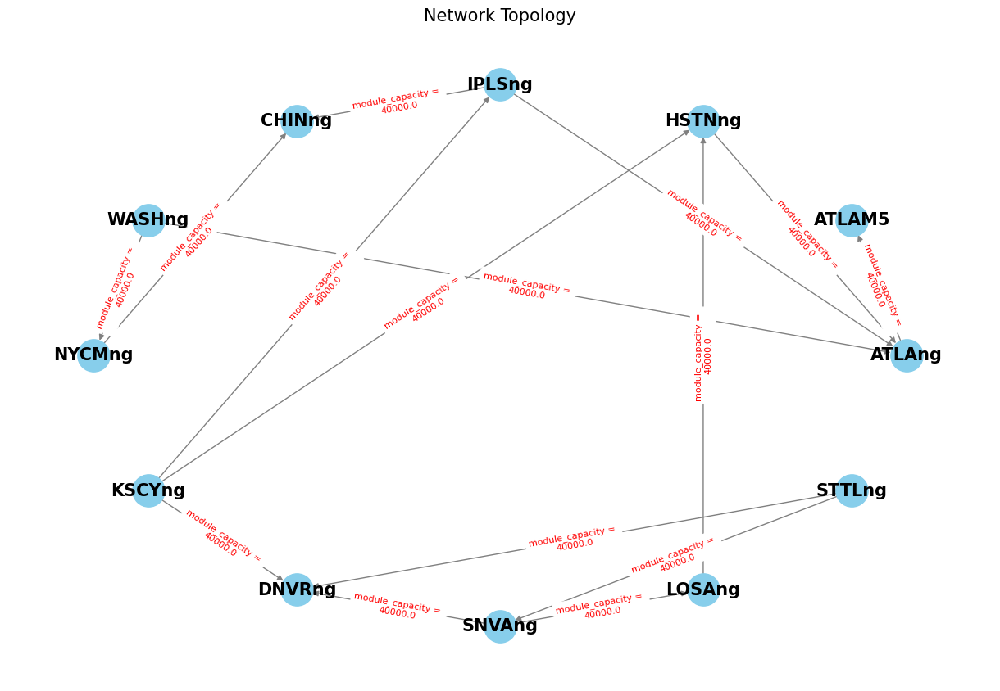

```python
import re
import networkx as nx
import matplotlib.pyplot as plt

# Data preprocessing function
def extract_node_data(data):
    nodes = {}
    pattern = re.compile(r'(\w+)\s+\(\s*(-?\d+\.\d+)\s+(-?\d+\.\d+)\s*\)')
    matches = pattern.findall(data)
    for match in matches:
        node_id, longitude, latitude = match
        nodes[node_id] = {'longitude': float(longitude), 'latitude': float(latitude)}
    return nodes

def extract_link_data(data):
    links = {}
    pattern = re.compile(r'(\w+_\w+)\s+\(\s*(\w+)\s+(\w+)\s*\)\s+(\d+\.\d+)\s+\d+\.\d+\s+\d+\.\d+\s+\d+\.\d+\s*\(\s*(\d+\.\d+)\s+\d+\.\d+\s*\)')
    matches = pattern.findall(data)
    for match in matches:
        link_id, source, target, capacity, cost = match
        links[link_id] = {
            'source': source,
            'target': target,
            'capacity': float(capacity),
            'cost': float(cost)
        }
    return links

def extract_demand_data(data):
    demands = {}
    pattern = re.compile(r'(\w+_\w+)\s+\(\s*(\w+)\s+(\w+)\s*\)\s+\d+\s+(\d+\.\d+)\s+\w+')
    matches = pattern.findall(data)
    for match in matches:
        demand_id, source, target, demand_value = match
        demands[demand_id] = {
            'source': source,
            'target': target,
            'demand_value': float(demand_value)
        }
    return demands

def process_data(data):
    # Extract node, link and requirement data
    nodes_data = extract_node_data(data)
    links_data = extract_link_data(data)
    demands_data = extract_demand_data(data)
    
    # Truncate node data to match the amount of link data
    num_nodes = len(nodes_data)
    num_links = len(links_data)
    if num_nodes > num_links:
        nodes_data = dict(list(nodes_data.items())[:num_links])
    
    return nodes_data, links_data, demands_data

# Read the data
with open('data_1.txt', 'r') as f:
    data = f.read()

# Process data
nodes_data, links_data, demands_data = process_data(data)

# Build network topology dictionary
network_topology = {}
for link_id, link_info in links_data.items():
    source = link_info['source']
    target = link_info['target']
    cost = link_info['cost']
    if source not in network_topology:
        network_topology[source] = []
    network_topology[source].append({'target': target, 'cost': cost})

# Print network topology dictionary
print("=== network topology dictionary ===")
for node, neighbors in network_topology.items():
    print(f"Node {node}: access to {[neighbor['target'] for neighbor in neighbors]}")

# Simple visualization of network topology
G = nx.DiGraph()
for source, neighbors in network_topology.items():
    for neighbor in neighbors:
        G.add_edge(source, neighbor['target'], weight=neighbor['cost'])

# Try layout algorithms
pos = nx.circular_layout(G)  # Using circular layout

# Draw nodes and edges
plt.figure(figsize=(12, 8))  # Resize image
nx.draw(G, pos, with_labels=True, node_size=800, node_color='skyblue', font_size=15, font_weight='bold', edge_color='gray') 

# Draw edge weights
labels = nx.get_edge_attributes(G, 'weight')
# Modify the labels to include the prefix "module_capacity = " and a newline before the number
labels_with_prefix = {e: "module_capacity = \n" + str(labels[e]) for e in labels}
nx.draw_networkx_edge_labels(G, pos, edge_labels={e: "module_capacity = \n" + str(labels[e]) for e in labels}, font_size=8, font_color='red')


plt.title('Network Topology', fontsize=15)  # Add title
plt.show()

```

    === network topology dictionary ===
    Node ATLAng: access to ['ATLAM5']
    Node HSTNng: access to ['ATLAng']
    Node IPLSng: access to ['ATLAng', 'CHINng']
    Node WASHng: access to ['ATLAng', 'NYCMng']
    Node NYCMng: access to ['CHINng']
    Node KSCYng: access to ['DNVRng', 'HSTNng', 'IPLSng']
    Node SNVAng: access to ['DNVRng', 'LOSAng']
    Node STTLng: access to ['DNVRng', 'SNVAng']
    Node LOSAng: access to ['HSTNng']
    


    

    


```python

```
